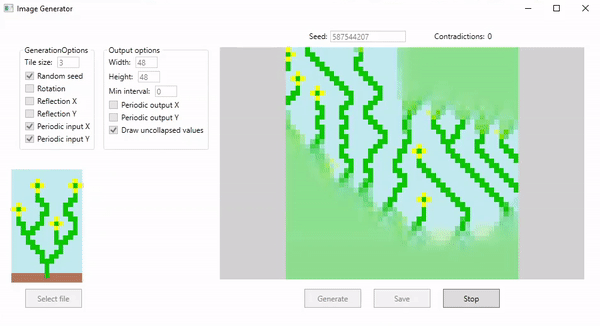

# WaveFunctionCollapse

My implemetattion on Wave Function Collapse algorithm, overlapping model. See the original implementation: https://github.com/mxgmn/WaveFunctionCollapse

Features
-------

- Supports any number of dimensions
- Works with any datatype(make sure to define equality!)
- Periodic input\output
- Backtracking
- Rotations(only works in 2D) and reflections

I made an image generation program in WPF as an example

